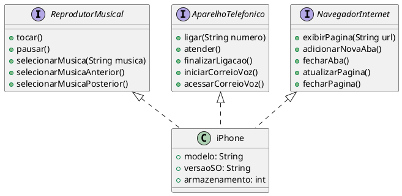

# **Diagrama UML - Modelagem do iPhone**

Este projeto consiste na modelagem UML do **iPhone**, destacando suas principais funcionalidades como **Reprodutor Musical, Aparelho Telefônico e Navegador na Internet**. A modelagem foi baseada no vídeo de lançamento do iPhone de 2007, visando representar suas capacidades de forma estruturada em **interfaces** e uma **classe principal**.

## **Objetivo**
- Criar um **Diagrama UML** que represente as funcionalidades do iPhone.  
- Implementar interfaces e classes no formato **Java**, separando as responsabilidades corretamente.  
- Garantir que a classe `iPhone` herde as funcionalidades de forma organizada.  

---

## **Funcionalidades Modeladas**

### **1. Reprodutor Musical**
Permite controle de reprodução de músicas.
#### Métodos:
- `tocar()`
- `pausar()`
- `selecionarMusica(String musica)`
- `selecionarMusicaAnterior()`
- `selecionarMusicaPosterior()`

### **2. Aparelho Telefônico**
Responsável pelas funcionalidades de chamadas.
#### Métodos:
- `ligar(String numero)`
- `atender()`
- `finalizarLigacao()`
- `iniciarCorreioVoz()`
- `acessarCorreioVoz()`

### **3. Navegador na Internet**
Gerencia a navegação web no iPhone.
#### Métodos:
- `exibirPagina(String url)`
- `adicionarNovaAba()`
- `fecharAba()`
- `atualizarPagina()`
- `fecharPagina()`

---

## **Diagrama UML**
Código PlantUML para gerar o diagrama:
